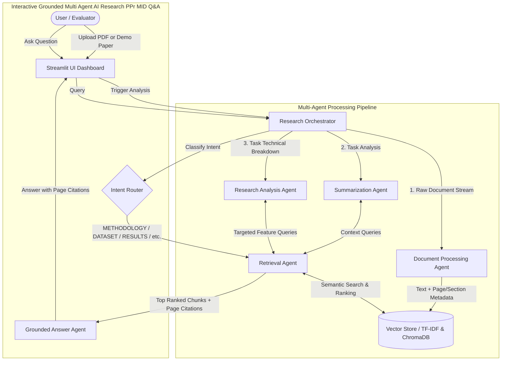

# Multi-Agent AI Research Assistant for Scientific Paper Analysis

> **Abstract:** Scientific literature review is a time-consuming process that requires searching, reading, comparing, and summarizing large volumes of research papers. Existing tools often provide limited search or summarization capabilities without intelligent collaboration between specialized AI components. This project proposes a **Multi-Agent AI Research Assistant** that employs multiple autonomous agents to perform scientific paper retrieval, semantic analysis, summarization, comparison, citation generation, and research gap identification. The system leverages Retrieval-Augmented Generation (RAG), Large Language Models (LLMs), vector databases, and Natural Language Processing (NLP) to provide accurate, context-aware responses and generate comprehensive literature reviews. The proposed web application will assist researchers, students, and academicians in accelerating scientific research while improving the quality and efficiency of literature analysis.

---

## 1. Problem Statement
Scientific literature is growing at an unprecedented exponential rate, with hundreds of thousands of papers published annually across arXiv, IEEE, ACM, and PubMed. Researchers, students, and engineers face severe challenges:
1. **Information Overload**: Reading 20-30 page papers end-to-end to assess methodology or benchmark datasets is time-prohibitive.
2. **Dense Technical Jargon**: Identifying core mathematical formulations, assumptions, and limitations requires cross-referencing multiple disparate sections.
3. **Chatbot Hallucinations**: Standard LLMs often invent facts, misquote ablation numbers, or attribute findings to the wrong authors when not strictly grounded in paper excerpts.

---

## 2. Objectives
This system implements a specialized multi-agent pipeline to:
- **Automate Document Parsing**: Extract text from academic PDFs, clean mathematical symbols, detect paper section hierarchies, and track exact page numbers.
- **Coordinate Specialized AI Agents**: Separate complex comprehension into focused agent roles (Parsing, Summarization, Methodological Analysis, Vector Retrieval, and Grounded Q&A).
- **Enforce Anti-Hallucination Grounding**: Cite exact source pages and sections for all assertions, explicitly responding `"Not found in the provided paper"` when evidence is absent.
- **Provide Live Explainability**: Expose inter-agent communication logs directly in the user interface.

---

## 3. System Architecture



---

## 4. Specialized Agents

| Agent Name                    | Input                                    | Output                                  | Core Responsibility                                                                                                                                                                                             |
| :---------------------------- | :--------------------------------------- | :-------------------------------------- | :-------------------------------------------------------------------------------------------------------------------------------------------------------------------------------------------------------------- |
| **Research Orchestrator**     | User actions & questions                 | Task delegation & coordination          | Acts as the supervisor managing pipeline stages, tracking runtime state, classifying query intents, and maintaining activity logs.                                                                              |
| **Document Processing Agent** | Uploaded PDF stream                      | Cleaned pages, section map, chunk index | Extracts raw PDF text page-by-page, filters unencodable artifacts, recognizes section boundaries (Abstract, Intro, Methods, Results, Conclusion), and segments text into overlapping chunks with page metadata. |
| **Retrieval Agent**           | Search query, top-$k$ parameter          | Ranked chunks with section & page tags  | Queries the vector store, ranks candidate text segments, formats citation blocks `[Page X, Section Y]`, and handles semantic deduplication.                                                                     |
| **Summarization Agent**       | Abstract & Introductory excerpts         | Structured multi-tier summaries         | Generates an Executive Summary, Section-by-Section Overview, Key Scientific Contributions, and Notable Findings.                                                                                                |
| **Research Analysis Agent**   | Methodological and experimental excerpts | Structured technical breakdown          | Extracts the exact Research Problem, Architecture & Methodology, Datasets & Benchmarks, Quantitative Results, and Limitations.                                                                                  |
| **Grounded Answer Agent**     | User query + retrieved chunks + intent   | Citation-backed response                | Synthesizes an evidence-based answer strictly from provided excerpts with exact page citations, enforcing strict anti-hallucination guardrails.                                                                 |

---

## 5. End-to-End Workflow

```text
1. PDF Ingestion
   └── pypdf extracts text stream page by page with font and whitespace normalization.

2. Structural Segmentation & Indexing
   └── Section headers detected; text segmented into 900-character chunks with 150-char overlap.
   └── Chunks indexed into VectorStore with metadata: {page, section, id, text}.

3. Multi-Agent Synthesis
   └── Orchestrator triggers Summarization and Analysis agents in sequence.
   └── Agents query targeted sections to produce structured research cards.

4. User Interaction & Grounded RAG
   └── User submits query -> Orchestrator classifies intent (e.g., DATASET, METHODOLOGY).
   └── Retrieval Agent fetches top-k chunks with page numbers.
   └── Answer Agent delivers answer with citations: "(Page 4, Section Methodology)".
```

---

## 6. Technologies Used
- **Core Language**: Python 3.10+
- **Frontend / Dashboard**: Streamlit
- **PDF Engine**: PyPDF (`pypdf`)
- **Embeddings & Vector Search**: scikit-learn (`TfidfVectorizer`, Cosine Similarity) with optional `ChromaDB` integration
- **LLM Integrations**: OpenAI-compatible client supporting:
  - **Groq** (`llama-3.3-70b-versatile`) — Recommended (ultra-fast, free tier)
  - **NVIDIA NIM** (`nvidia/nemotron-3-super-120b-a12b`)
  - **OpenAI** (`gpt-4o-mini`)
  - **Ollama** (`llama3.1`) — 100% local offline execution
- **Academic API Preview**: arXiv Atom XML API & Requests

---

## 7. Installation & Setup

### Prerequisites
- Python 3.10 or higher
- Internet connection (for initial pip dependencies & LLM API calls)

### Setup Instructions
1. Open PowerShell or Command Prompt in the project directory:
   ```powershell
   cd "c:\Users\shaan\Downloads\New folder (2)"
   ```
2. Install dependencies:
   ```powershell
   pip install -r requirements.txt
   ```

---

## 8. Running the Application

Launch the application with a single command:
```powershell
python research_assistant.py
```
*(Or alternatively: `streamlit run research_assistant.py`)*

The system will start the web application at:
👉 **http://localhost:8501**

---

## 9. Midterm Evaluation Demo Guide

For tomorrow's evaluation, follow this presentation flow:

1. **Step 1: Set Up LLM Key**
   - In the left sidebar under **LLM Provider**, select **Groq (Recommended Free/Fast)** or **OpenAI**.
   - Enter your API Key.
2. **Step 2: Load Paper**
   - Option A: Upload any scientific research paper in PDF format.
   - Option B: Click **"📥 Load Built-in Demo Paper (LoRA)"** in the sidebar. This loads the landmark *LoRA: Low-Rank Adaptation of Large Language Models* paper included directly in the repo.
3. **Step 3: Process & Analyze**
   - Click the primary **"🚀 Process & Analyze Paper"** button.
   - Expand the **"🕵️ View Real-Time Multi-Agent Activity Log"** to show the evaluator the live inter-agent coordination:
     ```text
     [Orchestrator] Initiating multi-agent ingestion workflow.
     [Document Processing Agent] Extracted 26 pages...
     [Retrieval Agent] Searching vector index...
     [Analysis Agent] Investigating methodology, datasets, and limitations...
     ```
4. **Step 4: Review Analysis Cards**
   - Navigate through:
     - **📋 Executive Summary**: Show Executive Summary & Key Scientific Contributions.
     - **🔬 Research Analysis**: Show the 6 structured cards (Problem, Method, Datasets, Results, Limitations, Future Work).
     - **🧩 Section Breakdown**: Show the structural breakdown and indexed chunks.
5. **Step 5: Test Grounded Q&A**
   - Switch to **💬 Ask the Paper**.
   - Click the preset test buttons or type:
     - *"What datasets were evaluated?"*
     - *"Explain the methodology and rank decomposition."*
     - *"What are the limitations?"*
   - Point out to the evaluator:
     - The **Agent Intent badge** (e.g., `Agent Intent: DATASET`).
     - The **Exact Page Citations** (e.g., `(Page 5, Section Experiments & Results)`).
     - Click **"🔍 View Retrieved Source Chunks"** to verify that the chunks are authentic text from the PDF.
6. **Step 6: Test Anti-Hallucination Guardrail**
   - Ask an unanswerable question: *"What is the recipe for chocolate cake?"*
   - The agent strictly responds: `"Not found in the provided paper."`

---

## 10. Scope Breakdown: Midterm vs. End-Term

### ✅ Completed for Midterm Evaluation
- [x] Single-file and PDF upload ingestion pipeline (`pypdf`)
- [x] Document Processing Agent with unicode sanitation and section detection
- [x] Vector Indexing with TF-IDF fallback and chunk-level page metadata
- [x] Multi-Agent Orchestrator with intent routing
- [x] Research Analysis Agent (Structured 6-point evaluation)
- [x] Summarization Agent (Executive summary & contributions)
- [x] Grounded Q&A Agent with exact page citations and anti-hallucination guardrail
- [x] Live visible agent activity logs in the UI
- [x] Built-in benchmark paper (`sample_lora_paper.pdf`) for reproducible testing

### 🔮 Planned for End-Term Phase
- [ ] Multi-paper cross-comparison and synthesis matrix
- [ ] Cross-paper contradiction detection and research gap graph
- [ ] Citation graph construction and citation verification audits
- [ ] Multimodal extraction of figures, plots, and LaTeX equations
- [ ] Fully autonomous arXiv / Semantic Scholar literature discovery agent
- [ ] Export to formatted LaTeX and IEEE/ACM Word documents
